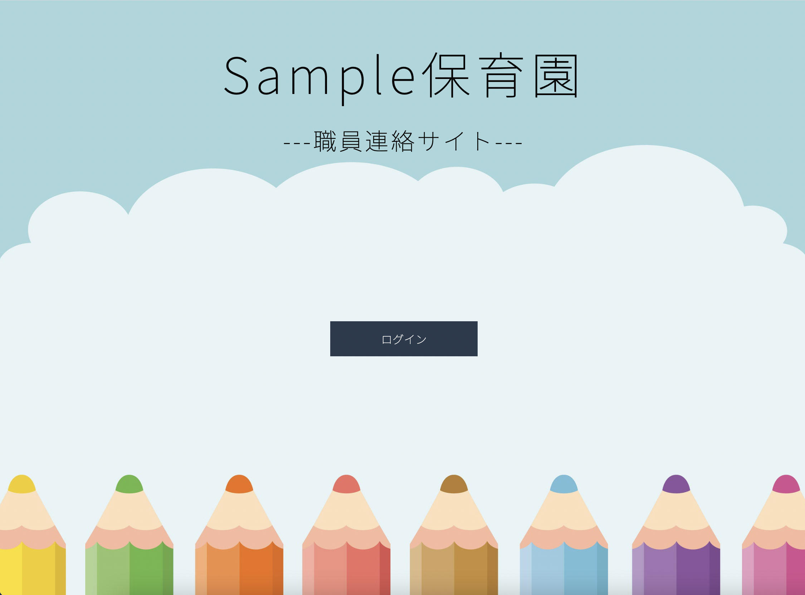

# Sample保育園 -職員連絡サイト-
HTML , CSS  , PHP を使用して、社内コミュニケーションツールを作成しました。 
 
実装した主な機能は以下の通りです。 
・ログイン機能 
・ログアウト機能 
・マイページ機能 
・投稿機能 
・投稿一覧表示機能 
・投稿削除機能 

|||

## usage
__【ログイン機能】__ 
・あらかじめ登録してあるメールアドレスのみでログインが可能です。 
 
__【ログアウト機能】__ 
・ログアウト後は、ログイン前のトップページに戻ります。 
 
__【マイページ機能】__ 
・ログイン後、投稿機能や投稿一覧表示機能を使うことができます。 
 
__【投稿機能】__ 
・パスワードなどの入力なしで、追加ボタンを押すだけで登録できます。 
・以下二つの項目の投稿機能があります。 
「引き継ぎ」 
&emsp;入力内容 
&emsp;&emsp;⚪︎子どものクラス 
&emsp;&emsp;⚪︎子どもの名前 
&emsp;&emsp;⚪︎引き継ぎ内容 
&emsp;&emsp;⚪︎投稿者（役職/氏名） 
「必要なもの」 
&emsp;入力内容 
&emsp;&emsp;⚪︎使う人/クラス 
&emsp;&emsp;⚪︎必要なもの 
&emsp;&emsp;⚪︎必要な数 
&emsp;&emsp;⚪︎いつまでに必要か 
&emsp;&emsp;⚪︎投稿者（役職/氏名） 
 
__【投稿一覧表示機能】__ 
・チェックボックスがあるため、解決済みか未解決か明確になります。 
・以下二つの項目の投稿一覧表示機能があります。 
「引き継ぎ内容」 
&emsp;クラス別に引き継ぎ内容を確認できます。 
&emsp;&emsp;⚪︎全体 
&emsp;&emsp;⚪︎0歳児クラス 
&emsp;&emsp;⚪︎1歳児クラス 
&emsp;&emsp;⚪︎2歳児クラス 
&emsp;&emsp;⚪︎3歳児クラス 
&emsp;&emsp;⚪︎4歳児クラス 
&emsp;&emsp;⚪︎5歳児クラス 
「必要なもの」 
&emsp;クラス別に必要なものを確認できます。 
&emsp;&emsp;⚪︎全体 
&emsp;&emsp;⚪︎0歳児クラス 
&emsp;&emsp;⚪︎1歳児クラス 
&emsp;&emsp;⚪︎2歳児クラス 
&emsp;&emsp;⚪︎3歳児クラス 
&emsp;&emsp;⚪︎4歳児クラス 
&emsp;&emsp;⚪︎5歳児クラス 
 
__【投稿削除機能】__ 
・パスワードなどの入力なしで、削除ボタンを押すだけで削除することができます。 
・「戻るボタン」「削除確認ボタン」があるため、誤って投稿を消してしまう可能性を低くしています。
